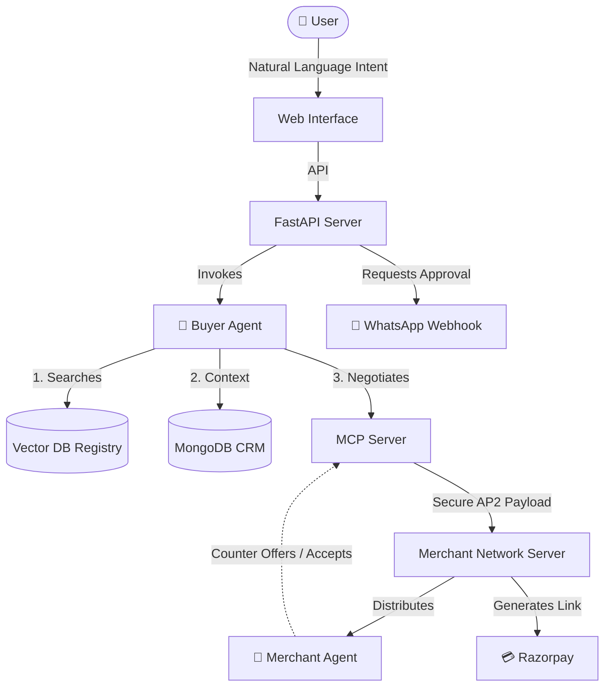

# Agentic Commerce Simulator 🚀

Agentic Commerce is an autonomous, multi-agent procurement and negotiation platform designed to revolutionize e-commerce interactions. By deploying LLM-powered buyer and merchant agents, the platform entirely automates the haggling and purchasing process.

<div align="center">
  <!-- Animation Placeholder -->
  
  <br/>
  <em>Live autonomous negotiation between the Buyer Agent and Merchant Network.</em>
</div>

## 🎯 What Does It Solve?

The traditional e-commerce experience is static and inflexible. Agentic Commerce introduces dynamic, AI-driven pricing and transactions to solve core inefficiencies for both sides of the marketplace:

- **For Buyers:** Reduces the hassle of manual price comparison and haggling. The autonomous buyer agent scours the registry, finds the right merchant, and aggressively negotiates to get the absolute best price—doing everything securely and even paying on behalf of the buyer.
- **For Merchants:** Maximizes profit through dynamic bundle deals and personalized pricing. The merchant agent utilizes intelligent upselling (e.g., offering accessories or volume discounts) before conceding on base prices, ensuring higher average order values.

## ✨ Key Features

- **Multi-Agent Negotiation Loop:** Autonomous Buyer and Merchant agents communicate over a secure, distributed network (via MCP) to negotiate pricing, terms, and bundles.
- **Dynamic Catalog & Vector Registry:** Merchants register their catalogs into a centralized vector database. The Buyer agent semantically searches this registry to find the exact items the user wants.
- **Secure Cryptographic Handshakes (AP2):** All agent-to-agent negotiations are secured using signed public/private key cryptographic handshakes to prevent spoofing.
- **WhatsApp Approval Flow:** Once a deal is struck, the platform uses a Twilio Webhook to ping the user on WhatsApp for final approval before processing the payment.
- **Razorpay Integration:** Real-time generation of secure payment links to finalize the transaction.
- **Persistent Audit Logging:** Every decision, counter-offer, and tool execution is logged into MongoDB and streamed live to the UI Negotiation Feed.

## 🏗️ Architecture



## 🚀 Getting Started

### Prerequisites
- Python 3.11+
- MongoDB instance (Atlas or Local)
- NVIDIA NIM API Key (for LLM inference)
- Twilio Account (for WhatsApp Sandbox)
- Razorpay Account (for Payments)

### Installation

1. **Clone the repository**
   ```bash
   git clone https://github.com/vishalRajaraman/Agentic-Commerce-Simulator.git
   cd Agentic-Commerce-Simulator
   ```

2. **Create a virtual environment and install dependencies**
   ```bash
   python -m venv venv
   source venv/bin/activate  # On Windows: .\venv\Scripts\activate
   pip install -r requirements.txt
   ```

3. **Configure Environment Variables**
   Create a `.env` file in the root directory:
   ```env
   NIM_API_KEY=your_nvidia_api_key
   TWILIO_ACCOUNT_SID=your_twilio_sid
   TWILIO_AUTH_TOKEN=your_twilio_token
   ```

4. **Seed the Database**
   ```bash
   python scripts/seed_massive_catalog.py
   ```

## 🎮 Running the Platform

To run the full multi-agent simulation, you need to spin up the independent components:

1. **Start the Main API & UI Backend (Terminal 1)**
   ```bash
   python -m uvicorn main:app --reload
   ```

2. **Start the MCP Server (Terminal 2)**
   ```bash
   python mcp/mcp_server.py
   ```

3. **Start the Merchant Network (Terminal 3)**
   ```bash
   python agents/merchant_server.py
   ```

4. **Access the UI**
   Open your browser and navigate to `http://localhost:8000`.

## 🛠️ Built With
- **FastAPI** - High-performance backend
- **LangChain & LangGraph** - Agentic workflows and streaming
- **Model Context Protocol (MCP)** - Secure tool execution and distributed agent communication
- **NVIDIA NIM (Nemotron)** - State-of-the-art LLM inference
- **MongoDB** - Profile and Audit persistence
- **Vanilla JS/CSS** - Lightweight, responsive frontend
